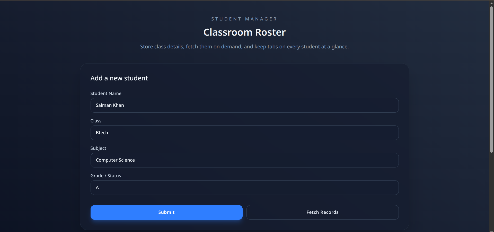
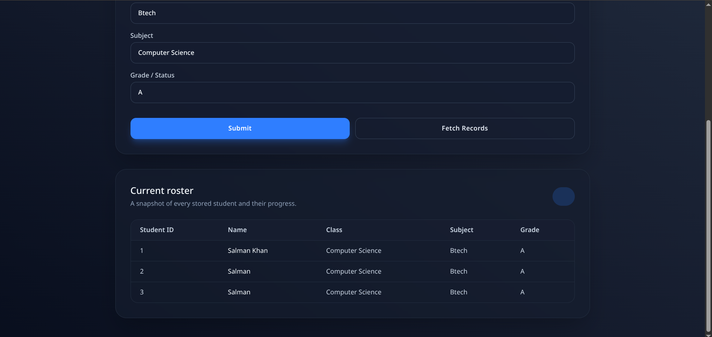

# Classroom Roster - MERN Student Manager using OOPS

<p align="center">
  
  
  
  
  
  
</p>

A streamlined MERN-stack classroom manager that lets you add students, fetch the current roster, and visualize progress with a polished React + Tailwind UI. The Express server keeps data locally in memory—powered by a class-based `Datastore` blueprint—so you can experiment quickly and extend toward a full MongoDB integration when you are ready.

---

## 📸 Demo of Running Application

<p align="center">
  
   
   <br>
   <em>Snapshots of the class-driven datastore flow: the form feeds `Datastore` objects and the table retrieves them in real time.</em>
</p>

---

## ✨ Why This Project?

- **Fast Iteration:** Prototype roster ideas without the overhead of a database layer.
- **Modern Frontend:** Crafted with Vite, React 19, and Tailwind for instant feedback and responsive layouts.
- **Student-Centric:** Tailored to track classroom metadata—names, classes, subjects, and statuses—at a glance.
- **Future-Ready:** Clearly structured to swap the in-memory store for MongoDB or another persistent backend later on.
- **OOP Foundation:** Demonstrates class-driven storage and retrieval via the `classSchema.js` `Datastore`, making it easy to reason about entities and evolve the domain model.

---

## 🚀 Features

- 🧑‍🎓 **Student Intake:** Capture name, class, subject, and grade/status with inline validation.
- 🔄 **On-Demand Sync:** Fetch the latest roster from the server whenever you need a refresh.
- 📊 **Responsive Table:** Review students in a compact, mobile-friendly table with empty-state guidance.
- 🧠 **Class-Based Storage:** Persist roster entries in memory using a reusable `Datastore` class, keeping retrieval logic simple and testable.
- ⚡ **Vite Dev Workflow:** Enjoy hot-module reloads and instant builds during development.

---

## 📁 Project Structure

```
Classroom-Roster/
├── client/                # React + Tailwind frontend (Vite)
│   ├── src/App.jsx        # Main UI logic
│   ├── src/main.jsx       # App bootstrap
│   ├── src/App.css        # Optional component overrides
│   └── package.json
├── server/                # Express API server
│   ├── index.js           # REST endpoints for roster operations
│   ├── classSchema.js     # In-memory data model
│   └── package.json
└── README.md              # You are here!
```

---

## 🛠️ Tech Stack

| Layer            | Technology            |
| ---------------- | --------------------- |
| **Client**       | React 19, Vite        |
| **Styling**      | Tailwind CSS          |
| **Server**       | Express 5 (Node.js)   |
| **Data Store**   | In-memory datastore (OOPs based)  |

---

## ⚡ Getting Started

Follow these steps to spin up both the API server and the React frontend locally.

### 1. Backend Setup (Express Server)

1. **Prerequisites:** Install Node.js (v18+ recommended) and pnpm.
2. **Install Dependencies:**
   ```bash
   cd server
   pnpm install
   ```
3. **Run the Server:**
   ```bash
   pnpm start  # or: node index.js if you prefer
   ```
   The API defaults to `http://localhost:3000` and exposes `/items` for GET and POST requests.

### 2. Frontend Setup (React + Vite)

1. **Prerequisites:** Node.js and pnpm, shared with the backend step.
2. **Install Dependencies:**
   ```bash
   cd client
   pnpm install
   ```
3. **Run the Dev Server:**
   ```bash
   pnpm run dev
   ```
   Vite will provide a local URL (typically `http://localhost:5173`). Ensure the Express server is running so the frontend can reach `http://localhost:3000/items`.

> 💡 **Custom API URL:** If you change the backend address, update the Axios URLs in `client/src/App.jsx` accordingly.

---

## 📖 How to Use

1. Launch both the Express server and the Vite dev server.
2. Open the frontend URL in your browser.
3. Fill in the student details and click **Submit** to push data to the API.
4. Click **Fetch Records** to load the current roster into the table.

---

## 📚 In-Depth Documentation

- **Frontend specifics:** `client/README.md`
- **Backend internals:** Review `server/index.js` and `server/classSchema.js`

Feel free to document additional endpoints or architectural decisions in component-level README files as the project grows.

---

## 🤝 Contributing

Contributions are welcome! Fork the repository, create a feature branch, and open a pull request. For enhancements or bugs, please open an issue so we can discuss the scope together.

---

## 👨‍💻 Author

Made with 💙 by M Salman Khan.

---

## 📜 License

This project currently uses the ISC License (see the `package.json` files). Update the license information if your distribution needs differ.

---

## 🌟 Show Your Support

If this project helps your classroom or MERN learning journey, please consider starring the repository and sharing it with fellow developers!
